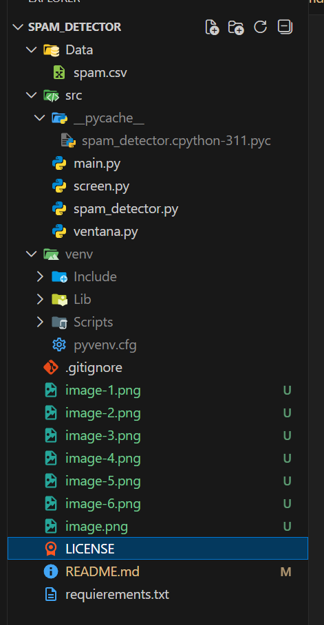
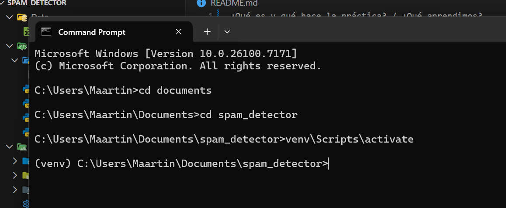
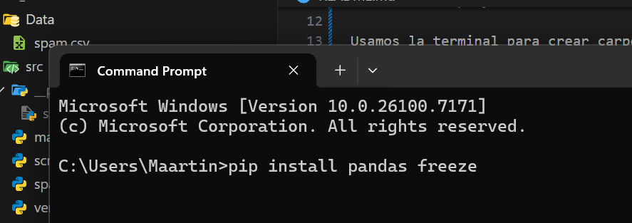
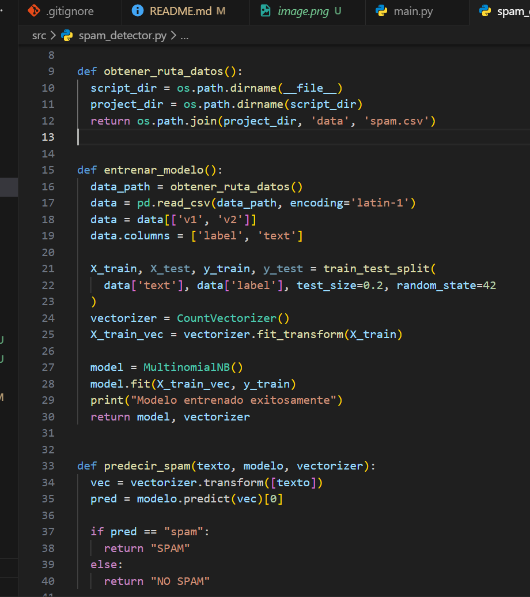
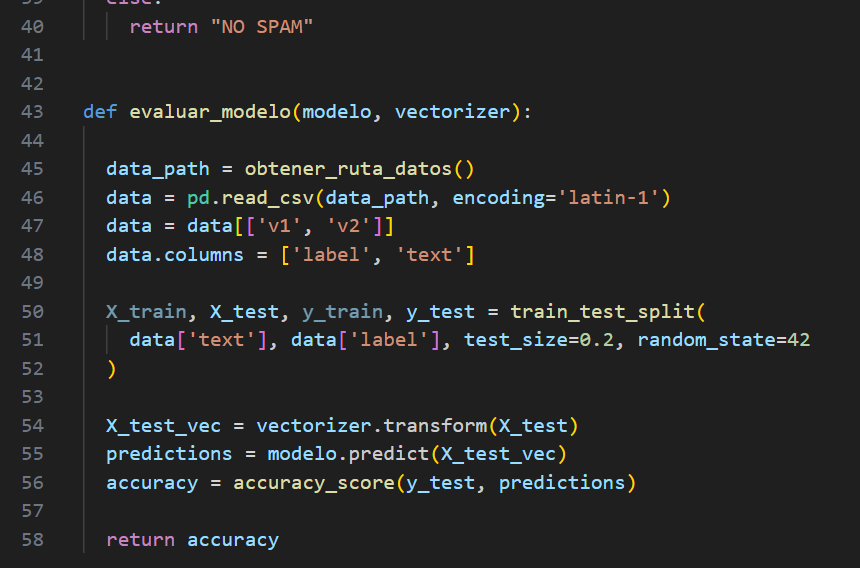
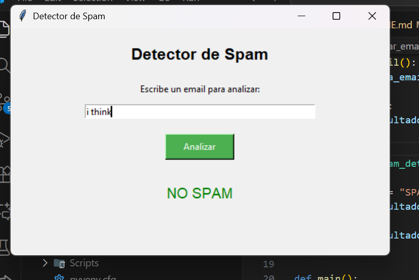
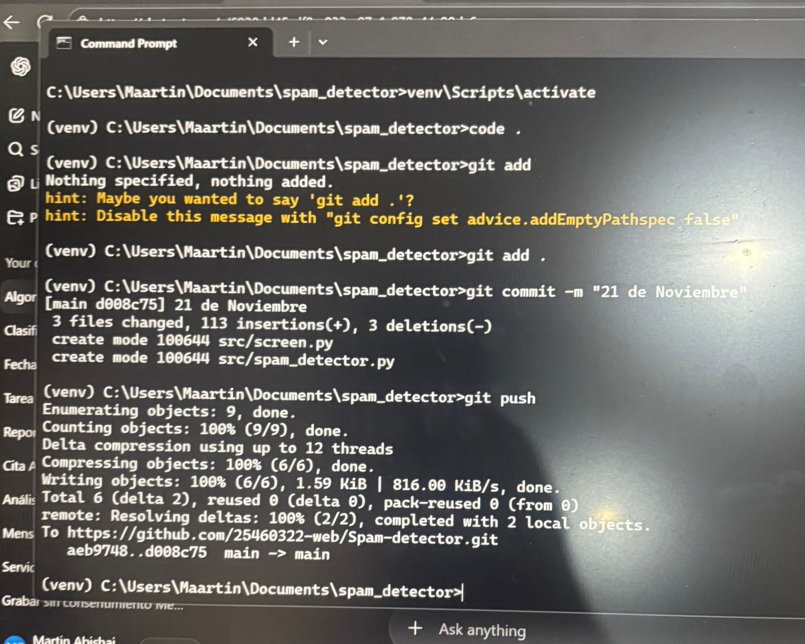
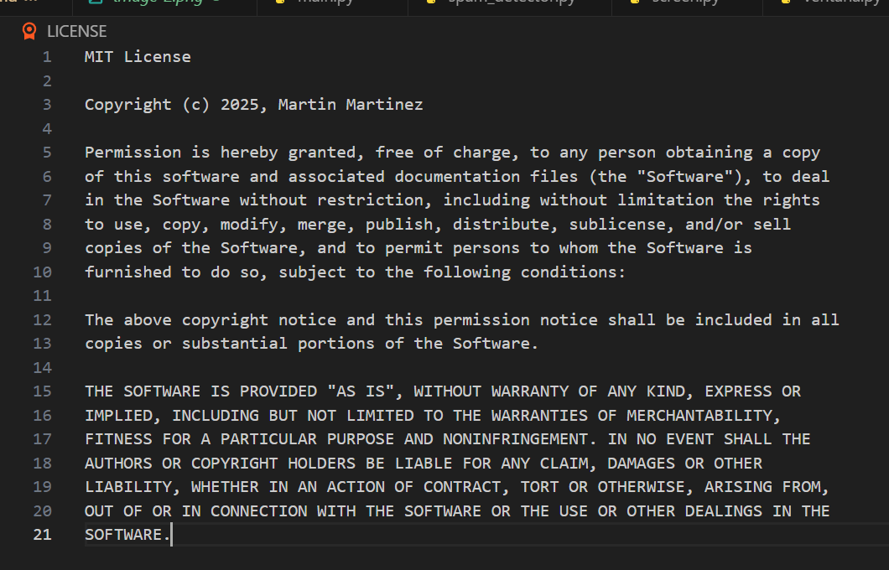

¿Qué es y qué hace la práctica? / ¿Qué aprendimos?

En esta práctica realizamos un proyecto desde cero para detectar mensajes de spam utilizando Python. La práctica combina conceptos de machine learning con la creación de una interfaz gráfica usando Tkinter, además de aprender a trabajar de forma profesional como un desarrollador: uso de la terminal, manejo de carpetas, entornos virtuales, Git y GitHub.

Aprendimos todo el proceso completo: desde crear la estructura de carpetas, instalar y activar un entorno virtual, instalar librerías necesarias sin afectar el sistema, cargar y limpiar datos de un dataset, entrenar un modelo de machine learning, evaluar su precisión y, finalmente, integrar todo en una ventana gráfica amigable para el usuario.

También reforzamos la importancia de revisar errores, identaciones, paréntesis y sintaxis en general, ya que varios errores surgieron por detalles mínimos que hubo que razonar y corregir manualmente.

¿Cómo lo hicimos? / Tecnologías y librerías utilizadas

Creación del proyecto

Usamos la terminal para crear carpetas con:

mkdir → crear carpetas

cd → movernos entre carpetas para organizar el proyecto para ayudarnos en la estructura del proyecto

Entorno virtual

Lo creamos con:

python -m venv venv

Lo activamos con:

venv\Scripts\activate

Esto nos ayudó a mantener un ambiente limpio e independiente.

Instalación de librerías
Usamos pip install para instalar las herramientas necesarias:

pandas → cargar y manipular datos

scikit-learn → entrenar el modelo de machine learning

tkinter → interfaz gráfica

freeze → generar lista de dependencias

Desarrollo del detector de spam

Cargamos el dataset spam.csv

Limpiamos columnas innecesarias

Dividimos datos en entrenamiento y prueba

Convertimos el texto a números usando CountVectorizer

Entrenamos el modelo para clasificar entre SPAM y NO SPAM

Creamos funciones para predecir si un mensaje es spam

Evaluamos la precisión del modelo

Interfaz gráfica

Creamos una ventana con Tkinter que incluye:

Título de la aplicación

Caja de texto para escribir el mensaje

Botón Analizar

Etiqueta que muestra el resultado:

SPAM en rojo

NO SPAM en verde

Uso de Git y GitHub

Configuramos Git:

git config --global user.name

git config --global user.email

git config --global init.defaultBranch main

git config --global --list

Inicializamos repositorio con git init

Usamos los comandos principales:

git add . → seleccionar archivos

git commit -m "" → guardar cambios

git push → subirlos a GitHub

Se agregó una licencia para darle formalidad al proyecto (importante en trabajos profesionales).
Siempre y cuando no se utilice IA

Trabajo futuro / Oportunidades de mejora / Solución de posibles errores

Aunque la aplicación funciona, existen muchas oportunidades para mejorarla:

Hacer un mejor procesamiento del texto (limpieza, normalización).

Probar modelos más avanzados de machine learning o NLP.

Agregar un botón para limpiar o reiniciar el contenido.

Mostrar dentro de la ventana la precisión del modelo.

Conectar una base de datos para guardar el historial de mensajes analizados.

Crear una versión web o móvil del proyecto.

Mejorar el diseño visual de la ventana.

Manejar errores comunes como:

Mala identación

Paréntesis o comillas abiertas

Imports mal escritos

Modelo no cargado correctamente

Estas correciones y analisis me permitirían tener una herramienta más profesional y robusta en el mundo laboral.